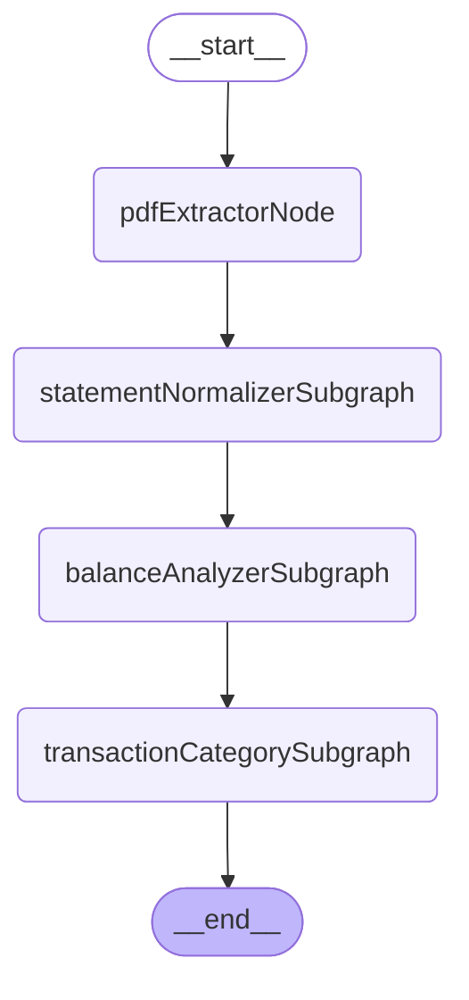

# advisor_graph

```mermaid
%%{init: {'flowchart': {'curve': 'linear'}}}%%
graph TD;
    start_node([__start__]):::first
    pdfExtractorNode(pdfExtractorNode)
    statementNormalizerSubgraph(statementNormalizerSubgraph)
    balanceAnalyzerSubgraph(balanceAnalyzerSubgraph)
    transactionCategorySubgraph(transactionCategorySubgraph)
    end_node([__end__]):::last

    start_node --> pdfExtractorNode;
    pdfExtractorNode --> statementNormalizerSubgraph;
    statementNormalizerSubgraph --> balanceAnalyzerSubgraph;
    balanceAnalyzerSubgraph --> transactionCategorySubgraph;
    transactionCategorySubgraph --> end_node;

    classDef default fill:#f2f0ff;
    classDef first fill-opacity:0;
    classDef last fill:#bfb6fc;
```
