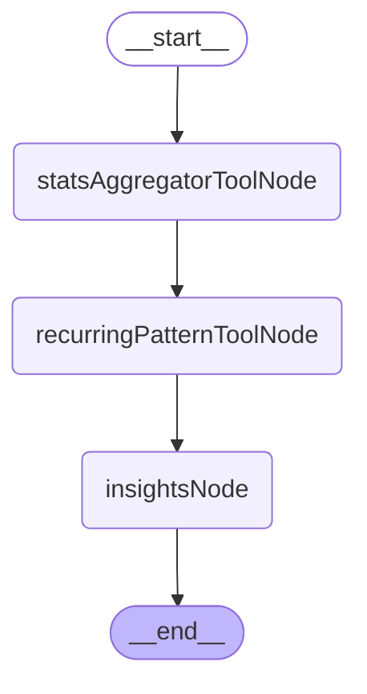

# insights_graph

```mermaid
%%{init: {'flowchart': {'curve': 'linear'}}}%%
graph TD;
	__start__([<p>__start__</p>]):::first
	statsAggregatorToolNode(statsAggregatorToolNode)
	recurringPatternToolNode(recurringPatternToolNode)
	insightsNode(insightsNode)
	__end__([<p>__end__</p>]):::last
	__start__ --> statsAggregatorToolNode;
	insightsNode --> __end__;
	recurringPatternToolNode --> insightsNode;
	statsAggregatorToolNode --> recurringPatternToolNode;
	classDef default fill:#f2f0ff,line-height:1.2;
	classDef first fill-opacity:0;
	classDef last fill:#bfb6fc;
```
