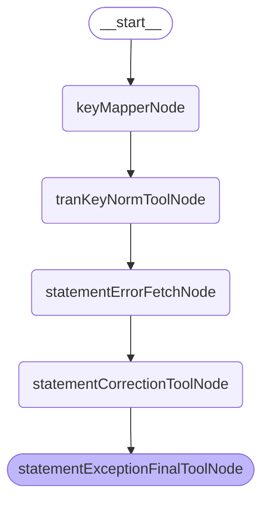

# normalizer_subgraph

```mermaid
%%{init: {'flowchart': {'curve': 'linear'}}}%%
graph TD;
	__start__([<p>__start__</p>]):::first
	statementErrorFetchNode(statementErrorFetchNode)
	keyMapperNode(keyMapperNode)
	tranKeyNormToolNode(tranKeyNormToolNode)
	statementCorrectionToolNode(statementCorrectionToolNode)
	statementExceptionFinalToolNode([statementExceptionFinalToolNode]):::last
	__start__ --> keyMapperNode;
	keyMapperNode --> tranKeyNormToolNode;
	statementCorrectionToolNode --> statementExceptionFinalToolNode;
	statementErrorFetchNode --> statementCorrectionToolNode;
	tranKeyNormToolNode --> statementErrorFetchNode;
	classDef default fill:#f2f0ff,line-height:1.2;
	classDef first fill-opacity:0;
	classDef last fill:#bfb6fc;
```
